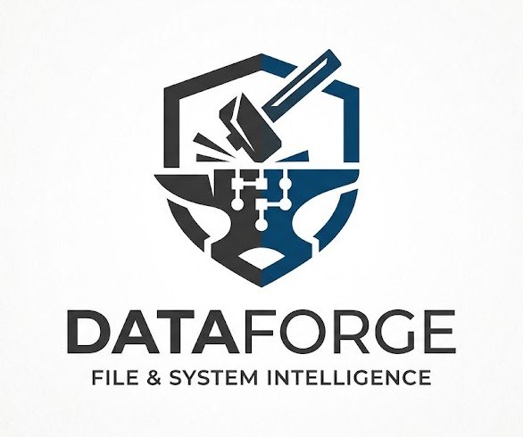

# 🔨 DataForge

## File System Management with Steroids and Superpowers

**Professional file and system intelligence platform** for power users, developers, and digital forensics specialists. Unified CLI + desktop experience for file discovery, organization, recovery, and forensic analysis.

DataForge provides both a **terminal interface** (`fm` CLI) and **interactive desktop application** (PyQt5 GUI). They share core services where applicable, while some desktop workflows (such as Action Builder and media tools) are GUI-only.

> **What's inside:** Enterprise-grade duplicate detection, forensic carving, integrity verification, automated cleanup, media batch processing, hardware diagnostics, artifact parsing, and workflow automation — all in one streamlined, production-tested toolkit.

<div align="center">
  
</div>

The GUI was migrated from Tkinter/ttkbootstrap to **PyQt5**, and new modules (hardware, forensics, recovery, metadata, performance, system cleanup, password tools, device manager, file signatures) were added. Documentation, packaging metadata, and CLI wiring have been reconciled to match. Remaining open items and a full audit are tracked in [`docs/reviews/AUDIT_REPORT.md`](./docs/reviews/AUDIT_REPORT.md).

## Why DataForge? (The Superpowers)

| Superpower | What You Get |
|---|---|
| **🎯 Find the noise** | Locate duplicates by content hash, search by name/size/age/content, parse forensic artifacts in seconds — find what matters, fast |
| **🧹 Clean and organize** | Batch operations, integrity snapshots, automated cleanup by category, one-click categorized organization — organize chaos in minutes |
| **🔍 Go deep into data** | Forensic file carving, GPS metadata stripping, disk SMART health, password strength analysis, trash recovery — extract what's hidden |
| **⚡ Unified interface** | Terminal and desktop — shared core where applicable, with GUI-only features (Action Builder, media tools) called out — no tool switching |
| **🧩 Extensible** | Action Builder pipeline for custom multi-step workflows; plugin system for custom views; scriptable CLI — build your own workflows |
| **🛡️ Production-ready** | 1213 passing tests (+2 skipped, 1 NTFS caveat) + dc44be4 UI fixes, thread-safe batch operations, dry-run previews, cancellation support, detailed logging — trust the tool |
| **🚀 Automation at scale** | Parallel hashing, batch operations on thousands of files, configurable worker threads, progress tracking, cancellation — process like a pro |
| **🔐 Enterprise features** | Detail level (Simple/Standard/Everything), audit logging, integrity verification, forensic reports — audit-ready |

## What DataForge Does (The Arsenal)

### 🧹 Cleanup & Organization (On Steroids)
- **Duplicate detection** — find identical files by content hash, export reports, auto-select keep strategy, batch delete/move — **reclaim gigabytes in seconds**
- **Junk removal** — scan and remove cache, temp, logs, and crash reports by category (system temp, user cache, thumbnails, trash) — **one command to clean it all**
- **Storage analysis** — disk usage reports with top folders and size distributions — **understand where your space went**
- **Empty folder cleanup** — recursive empty-directory removal — **restore folder hygiene**

### 🔍 Discovery & Search (Supercharged)
- **Advanced search** — by filename (glob/regex), extension, size range, modification date, file contents (with regex) — **find anything, anywhere**
- **Batch organization** — move or copy search results to a target location with collision handling — **organize at scale**
- **Export results** — CSV, JSON, JSONL formats for downstream processing — **integrate with your tools**

### 📝 File Operations (Batch Mode)
- **Batch rename** — regex replacement, template-based naming (`{date}`, `{counter}`, `{ext}`), find/replace with prefix/suffix — **rename thousands at once**
- **Archive creation** — zip selected or all results with configurable compression; per-file or single archive mode — **compress intelligently**
- **Media tools** — merge/split PDFs, batch convert and resize images (PNG/JPEG/WEBP/BMP) — **transform media in bulk**

### 🔐 Data Integrity & Recovery (Fort Knox Edition)
- **Integrity snapshots** — create SHA-256 baselines (MD5 legacy supported), verify changes (NEW/MODIFIED/DELETED detection) — **detect tampering**
- **Trash recovery (Linux/macOS only)** — restore deleted files from Trash or external media — **get files back** — Windows raises `TrashScanUnsupported` (`recovery.py:208` — pywin32 follow-up)
- **File carving** — recover files from disk images by signature (JPEG, PNG, PDF, ZIP, and 30+ more types) — **resurrect lost data**
- **Metadata cleaning** — strip EXIF (including GPS), PDF metadata, and other embedded data — **sanitize before sharing**

### 🔬 Forensics & System Analysis (Full Arsenal)
- **OS artifact parsing (Linux/macOS only)** — registry, logs, temporary artifacts analysis — **uncover system secrets** — Linux: full (`/etc/passwd`, `auth.log`, `dpkg`, `systemd`); macOS: partial; Windows: not yet supported (`forensics.py:602`)
- **Keyword search** — full-text search across a directory or disk image — **hunt for evidence**
- **Hash calculation** — MD5, SHA-1, SHA-256, SHA-512 cryptographic file hashing with caching — **verify file integrity**
- **File signatures** — identify file types by magic bytes across 40+ categories — **know what you're looking at**
- **Hardware diagnostics** — CPU, RAM, motherboard, storage, GPU profiles; SMART disk health; upgrade recommendations — **assess your machine**
- **System performance** — top processes by memory, startup items, disk health status — **optimize and monitor**
- **Device manager** — list connected storage (internal, USB, network, optical) with per-device usage — **track all your storage** (also surfaced in the GUI as the **Storage & Devices** view, 2d.4)

### 🚀 Automation & Extensibility (Power User Paradise)
- **Action Builder** — compose reusable multi-step pipelines (filter → rename → move → archive) with drag-reorder UI — **automate complex workflows**
- **Plugin system** — extend the GUI with custom views; bundled example: Metadata Cleaner plugin — **customize it your way**
- **CLI scripting** — JSON/JSONL output, dry-run modes, all operations scriptable via `fm` command — **integrate anywhere**

## System at a Glance

| Area | Details |
| --- | --- |
| **Product** | 🔨 **DataForge** — File system management with steroids and superpowers (code: `dataforge/`) |
| **CLI** | `fm` command → `dataforge.cli:main` (16 top-level commands/groups; see the capability map for GUI-only features) |
| **GUI** | `python run_ui.py` → `dataforge.ui.app.DataForgeApp` (PyQt5, 14 views, task-oriented sidebar) |
| **Config** | `~/.dataforge/config.json` (theme, performance, exclusions, dashboard paths, detail level) |
| **Cache** | `~/.dataforge/cache.db` (SQLite hash cache, thread-safe with WAL, parallel hashing) |
| **Logging** | `~/.dataforge/app.log` (rotating, 5 MB / 3 backups, full audit trail) |
| **Architecture** | Layered: core primitives → operations → service layer → modules → GUI/CLI orchestration (shared logic, zero duplication) |
| **Tests** | 723 passing (`pytest`, full coverage across all feature layers, production-grade quality) |
| **Build** | `pyproject.toml` (CLI/core packaging), `build_exe.py` (PyInstaller → standalone desktop bundles, one-file release mode) |

## Quick Start

**For GUI users:** just install and run. **For developers/automation:** CLI all the way.

### Install

```bash
cd DataForge
python -m venv .venv
source .venv/bin/activate  # On Windows: .venv\Scripts\Activate.ps1
pip install -r requirements.txt
pip install -e .
```

### Launch

**Desktop GUI:**
```bash
python run_ui.py
```
Browse for duplicates, organize files, inspect hardware — all from a clean, tabbed interface.

**Terminal CLI:**
```bash
fm --help
fm search ~/Documents --name-glob "*.pdf"
fm dupes ~/Downloads --sort size --limit 20
fm forensics --list-types
fm cleanup --category "User Cache" --dry-run
```

No install? Use:
```bash
PYTHONPATH=. python -m dataforge.cli --help
```

### Verify the Build

```bash
PYTHONPATH=. pytest -q  # 723 tests pass
```

Full test suite passes — 723 tests. All correctness fixes are verified. See [`docs/reviews/AUDIT_REPORT.md`](./docs/reviews/AUDIT_REPORT.md) and [`docs/reviews/FORENSIC_REVIEW.md`](./docs/reviews/FORENSIC_REVIEW.md) for the full audit.

### Build desktop executables

```bash
python build_exe.py release
python build_exe.py debug
```

## Common Use Cases

| You Are | Try This |
|---------|----------|
| **Storage cleanup expert** | `fm cleanup --category "User Cache" --min-age 30 --dry-run` then `--execute` |
| **Mac/Linux user with bloat** | GUI: System Cleanup view → select junk categories → review → clean |
| **Photo manager** | GUI: Duplicate Finder → scan photos folder → sort by size → keep largest |
| **System forensics analyst** | `fm forensics ~/Evidence --search-keyword "confidential"` + `fm hash-calc --algo sha256` |
| **IT auditor** | `fm integrity create /critical_data snapshot.json` → `fm integrity check /critical_data snapshot.json` (detect tampering) |
| **DevOps automating cleanup** | `fm dupes --format jsonl \| jq '.path' \| xargs rm` (scripted duplicate removal) |
| **Data hoarder organizing chaos** | GUI: Search → glob pattern → preview → move to categorized folders |
| **Incident responder** | `fm recover --carve /dev/sdb1 --out ~/Recovered --types jpg,png,pdf` |
| **Metadata scrubber** | `fm metadata photo.jpg --strip-gps` (remove location before sharing) |
| **Workflow builder** | GUI: Action Builder → filter by date → rename template → move to archive → zip |

## Documentation Map

**Current truth (start here):**
- [`docs/APP_REFERENCE.md`](./docs/APP_REFERENCE.md) — consolidated application guide: features, safety, config, deps, platform support (source verified 2026-08-22)
- [`docs/ARCHITECTURE.md`](./docs/ARCHITECTURE.md) — layered design, control flow, shared abstractions, extension points
- [`docs/CLI_REFERENCE.md`](./docs/CLI_REFERENCE.md) — complete CLI reference (16 groups / 17 leaf commands) with examples
- [`docs/GUI_WORKFLOWS.md`](./docs/GUI_WORKFLOWS.md) — view-by-view desktop workflows, threading, background execution
- [`docs/TECHNICAL_SOURCE_OF_TRUTH.md`](./docs/TECHNICAL_SOURCE_OF_TRUTH.md) — authoritative file-by-file source map for maintainers
- [`docs/DEVELOPMENT_GUIDE.md`](./docs/DEVELOPMENT_GUIDE.md) — setup, testing, packaging, onboarding paths
- [`docs/CONTRIBUTING.md`](./docs/CONTRIBUTING.md) — commit convention, versioning, release process

**Proposals (future architecture, not yet implemented):**
- [`docs/proposals/PERFORMANCE_INVESTIGATION.md`](./docs/proposals/PERFORMANCE_INVESTIGATION.md) — parallel scanner, batched cache, engine/API split
- [`docs/proposals/NATIVE_OS_API_REVIEW.md`](./docs/proposals/NATIVE_OS_API_REVIEW.md) — native OS service: UDS/Named Pipes + D-Bus/XPC/COM
- [`docs/proposals/INSTALL_UPGRADE_LIFECYCLE.md`](./docs/proposals/INSTALL_UPGRADE_LIFECYCLE.md) — installable/removable/upgradable: XDG/AppData, migrations, deb/rpm/msi/dmg
- [`docs/DOCUMENTATION_AUDIT_2026-08-22.md`](./docs/DOCUMENTATION_AUDIT_2026-08-22.md) — audit of all docs vs. code (this cleanup)

**Project history & reviews (`docs/reviews/`):**
- [`README.md`](./docs/reviews/README.md) — start here: overview, findings index, remediation status, brand identity
- [`AUDIT_REPORT.md`](./docs/reviews/AUDIT_REPORT.md) — 15 correctness bugs (all fixed) + 13 security findings (S1–S13 fixed); forensic checklist, remediation order
- [`FORENSIC_REVIEW.md`](./docs/reviews/FORENSIC_REVIEW.md) — forensic-soundness + investigator UX (F1–F21, U1–U11) vs. EnCase/FTK/AXIOM/FIM
- [`ROADMAP.md`](./docs/reviews/ROADMAP.md) — UX/UI + engineering roadmap (Phases 2a–2e shipped; WS-F open)
- [`ROADMAP.md`](./docs/reviews/ROADMAP.md) — sequenced work-streams + release mapping (WS-A … WS-J)
- [`AUDIT_REPORT.md`](./docs/reviews/AUDIT_REPORT.md) — doc-defect audit D1–D7 (historical)

**Draft:** [`reviews/drafts/FULL_APP_REVIEW.md`](./docs/reviews/drafts/FULL_APP_REVIEW.md) — WIP line-level review (R-CORE/R-OPS, §3+ pending)

**Project History:**
- [`CHANGELOG.md`](./CHANGELOG.md) — version history, release notes, and migration notes

## Directory Structure

| Path | Purpose |
| --- | --- |
| **`CHANGELOG.md`** | Version history and release notes (Keep a Changelog format) |
| **`run_ui.py`** | Desktop GUI entry point (PyQt5 application launcher) |
| **`build_exe.py`** | PyInstaller bundler for standalone executables (release/debug) |
| **`dataforge/cli.py`** | 16 CLI commands/groups via Click (scan, dupes, search, organize, rename, clean, usage, integrity, cleanup, performance, recover, metadata, hardware, forensics, hash-calc, devices) |
| **`dataforge/core/`** | Shared foundation: file model, scanner, config, cache, hasher, logger, operations layer |
| **`dataforge/core/services/`** | `FileActionService` — centralized batch file operations (move, copy, delete, rename, archive with progress/cancel/dry-run) |
| **`dataforge/core/actions/`** | Action Builder pipeline engine: filters, IO steps, transformations, media operations |
| **`dataforge/modules/`** | Feature implementations (search, duplicates, organizer, cleaner, integrity, usage, reporting, forensics, hardware, recovery, metadata, performance, system_cleanup, password_tools, device_manager, file_signatures) |
| **`dataforge/ui/`** | PyQt5 desktop shell, 14 built-in views, widget library, plugin loader, design-token module (`theme_tokens.py`) |
| **`dataforge/ui/views/`** | Dashboard, Search, Duplicates, Media Tools, Metadata & EXIF, Automations (Action Builder + Tools), Clean Up Space, Storage & Devices, Performance, File Recovery, Forensics, Hardware Info, Settings, About & Help |
| **`dataforge/ui/resources/icons.py`** | 18 stroke-only monochrome SVGs (sidebar icons, expand/collapse chevrons, sun/moon theme toggle) — 2e.7 |
| **`dataforge/ui/plugins/`** | Plugin system; bundled example: Metadata Cleaner plugin |
| **`tests/`** | 1213 passing tests (+2 skipped, 1 NTFS caveat) + dc44be4 UI fixes: comprehensive, integration, contract, new-modules suites, token-regression guard |
| **`docs/`** | Architecture, CLI reference, GUI workflows, development guide, audit reviews |
| **`build/`, `dist/`** | Generated build artifacts (output only, not maintained source) |

## Architecture: Why It's Supercharged

DataForge is built in strict layers so the **same superpower logic runs in CLI and GUI** without duplication:

```
┌─────────────────────────────────────────────────────────────┐
│  CLI Superpowers           │  GUI Superpowers               │
│  🔨 16 groups (17 leaf)    │  ⚡ 14 views + plugins         │
│  ⚙️ Scriptable             │  🎨 Interactive               │
│  📊 JSON/JSONL output      │  🎯 Visual workflow builder   │
└─────────┬────────────────────────────────────────┬─────────┘
          │    (Both access the same superpower core)        │
┌─────────▼────────────────────────────────────────▼─────────┐
│  🔍 Forensics  🧹 Cleanup  📦 Recovery  🎬 Media  ⚙️ Ops   │
│  (Shared Feature Modules — where the real magic lives)     │
└────────────────────────┬────────────────────────────────────┘
                         │
┌────────────────────────▼────────────────────────────────────┐
│  🚀 FileActionService — Batch Operations (move/copy/delete)│
│     ⚡ Parallel execution  🔄 Progress tracking            │
│     ✓ Dry-run preview     ⏸️ Cancellation support         │
└────────────────────────┬────────────────────────────────────┘
                         │
┌────────────────────────▼────────────────────────────────────┐
│  🛠️ Core Operations │ 🔎 Scanner │ ⚙️ Config │ 💾 Cache    │
│  (The foundation that makes it all work)                   │
└─────────────────────────────────────────────────────────────┘
```

**Why this supercharged architecture matters:**
- **Superpower consistency** — a forensic search works identically from `fm forensics --search-keyword` and the GUI Forensics view
- **Maintenance superpowers** — a bug fix or new feature in deduplication logic instantly benefits CLI, desktop, and Action Builder
- **Testing superpowers** — test the logic once, verify all three interfaces automatically
- **Extensibility superpowers** — new pipeline steps, new CLI commands, and new GUI views can be built faster

The **two user interfaces are thin adapters** — all the real superpowers live in shared modules, services, and the core operations layer.

## Project Status

### ✅ Fixed in the 2026-07-10 Audit Pass

- **Correctness** — 723 tests pass. All correctness bugs fixed: MD5→SHA-256 defaults, symlink-loop scope escape, thread-safe cache, JSON error handling, SHA-512 crash, etc.
- **UI/UX overhaul** — Phase 2a/2b/2c/2d/2e shipped: surface brightness fix, themed checkboxes/combos, design-token module (`ui/theme_tokens.py`) with AA-validated colours replacing three legacy colour vocabularies, type-scale constants, per-widget colour migration, file-vs-folder riddle removed (2c.1), settings autosave (2c.2), dark-mode dedup (2c.3), progressive disclosure (2c.4), destructive checklist (2c.5), named busy task (2c.6), rich help (2c.7), task-oriented sidebar (2d.1), Automations merge (2d.2), label renames (2d.3), `fm devices` GUI (2d.4), stray-name sweep (2d.5), animated sidebar/view transitions (2e.1), native indeterminate `QProgressBar` busy indicator (2e.2), Reduce motion setting (2e.3), `focus_ring` token + `:focus` QSS for every interactive widget (2e.4), purposeful `EmptyState` + `friendly_error_message` (2e.5), screen-reader `accessibleName`/`accessibleDescription` + colour-blind `⚠` glyph on destructive Proceed (2e.6), and an 18-icon monochrome SVG sidebar set (2e.7).
- **Security findings** — S1–S13 are all fixed. R-CORE-1, R-OPS-1/2/3/4 are fixed. Forensic-soundness findings F1–F3/U2/F9 are fixed (hash-chained audit log, CaseContext, Evidence Mode, UTC provenance). Residual work (F4/F21 `secure_delete` move, F13 parser isolation) is in [`FORENSIC_REVIEW.md`](./docs/reviews/FORENSIC_REVIEW.md).
- **Engine & packaging** — Wave 0–3 of the parallel backlog complete (23/25 tickets): canonical paths, FileProvider ABC, API schemas, parallel scanner/hasher/cache, streaming modules, parallel batch ops, UDS/Named Pipe transports, daemon+client integration, systemd/launchd/Windows lifecycle, nfpm deb/rpm packaging, audit log + Evidence Mode.
- **Documentation** — ARCHITECTURE, CLI_REFERENCE, GUI_WORKFLOWS, DEVELOPMENT_GUIDE, TECHNICAL_SOURCE_OF_TRUTH all verified against current source.
- **Packaging** — pyproject.toml and build_exe.py verified; onefile+onedir profiles; nfpm deb/rpm packaging; release bundle working.

### 🔄 Open / Future

- **CI** — `.github/workflows/ci.yml` now runs pytest + coverage, ruff, mypy, and pip-audit on every push/PR.
- **Numbered release** — No public release number yet. `pyproject.toml` has internal version `0.1.0`; the v0.2.0 release PR opens after WS-G closes (`v0.2.0-alpha.1` through `v0.2.0-alpha.5` are tagged on `develop`; WS-G remains).
- **Debug build artifacts** — `build/debug` and `dist/debug` predate the PyQt5 migration; `build/release` is current. Run `python build_exe.py debug` to refresh.
- **Remaining backlog** — Wave 4 (TICK-401 UI job manager, TICK-402 version sync) is the final wave. F4/F21 (`secure_delete` move), F13 (parser isolation) remain for v0.3.0.

### 📋 Security & Audit

All 13 security findings (S1–S13) are **fixed** in the current source. Per-severity tally:
- 🔴 High: **2/2** (S1 MD5 default, S2 forensic XSS)
- 🟠 Medium: **7/7** (S3 symlink scope, S4 trash-restore, S5 plugin loader, S6 `secure_delete`, S7 cleanup, S8 secret hygiene, S13 decomposition bombs)
- 🟡 Low: **4/4** (S9 XML, S10 config validation, S11 OS-handler, S12 forensic permissions)

See [`docs/reviews/AUDIT_REPORT.md`](./docs/reviews/AUDIT_REPORT.md) for severity, impact, and per-finding fix detail. The remaining forensic-soundness work (F1–F21 / U1–U11) is in [`FORENSIC_REVIEW.md`](./docs/reviews/FORENSIC_REVIEW.md).

## Developer & Deployment Notes

- **Repo layout** — The Python package lives in `dataforge/` at the repository root. Run commands from the repo root.
- **Dependency split** — `pyproject.toml` = CLI + core only. `requirements.txt` = full stack (GUI/media). Install both for development.
- **User data** — `~/.dataforge/config.json`, cache.db, app.log — all created on first run, no migration needed.
- **Build artifacts** — `build/` and `dist/` are generated; don't maintain them. `release` profile is current; refresh `debug` via `python build_exe.py debug`.
- **Next milestone** — WS-A through WS-F and WS-H are all done (CI/CD, linting, packaging, S1–S13 security, design tokens, interaction correctness, IA/label/parity, motion/empty-error/a11y polish, architecture consolidation, forensic soundness). Next is WS-G (brand/release polish) — the v0.2.0 release PR opens after WS-G closes. See [`docs/reviews/ROADMAP.md`](./docs/reviews/ROADMAP.md).

---

## Contributing

DataForge is an open-source project. The audit and roadmap under [`docs/reviews/`](./docs/reviews/) identifies gaps, security enhancements, and feature requests. PRs are welcome — start with the [Development Guide](./docs/DEVELOPMENT_GUIDE.md) and the [Architecture](./docs/ARCHITECTURE.md) reference.

**For questions:**
- File an issue in the repository
- Check the [audit findings](./docs/reviews/AUDIT_REPORT.md) — your question may be answered there
- Review the [CLI reference](./docs/CLI_REFERENCE.md) and [GUI workflows](./docs/GUI_WORKFLOWS.md) for usage

---

**DataForge: Professional File & System Intelligence** — unified CLI and desktop toolkit for discovery, organization, forensics, and recovery.
